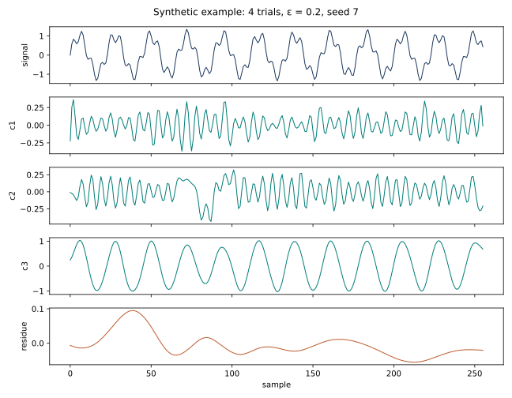

# ICEEMDAN CPU

Implementación importable de **Improved Complete Ensemble Empirical Mode Decomposition with Adaptive Noise** para CPU. Solo necesita NumPy y SciPy en tiempo de ejecución; PyEMD es opcional para una comparación aparte. El repositorio no distribuye registros biomédicos ni imágenes del artículo.



La señal de la figura se genera en `scripts/make_synthetic_figure.py`. [English README](README.md).

## Instalación y uso

Requiere Python 3.10 o posterior:

```bash
python -m pip install .
```

```python
import numpy as np
from ICEEMDAN import ICEEMDAN

t = np.arange(256, dtype=float)
x = np.sin(0.2 * t) + 0.3 * np.sin(0.7 * t)
model = ICEEMDAN(trials=50, epsilon=0.2, seed=42)
parts = model(x, T=t)
imfs, residue = model.get_imfs_and_residue()
assert np.allclose(parts.sum(axis=0), x)
print(parts.shape, model.diagnostics_["stop_reason"])
```

La última fila de `parts` **siempre es el residuo**. Las filas anteriores son componentes extraídos; la extracción no demuestra por sí sola que sean modos físicos ni IMF exactas. `max_imf` limita el número de componentes. Con `parallel=True`, ejecute desde un script importable protegido por `if __name__ == "__main__":`.

[Método y contratos numéricos](docs/METHOD.md) explica los parámetros, los criterios de parada y los límites.

## Reproducibilidad

El [mapa de reproducibilidad](docs/PAPER_REPRODUCIBILITY.md) separa los contratos del código, las aproximaciones Python, las coincidencias candidatas con datos públicos y las fuentes aún desconocidas de las figuras 1–15. No afirma igualdad numérica con la implementación MATLAB de los autores.

Para pruebas breves: `python -m pytest -q`. El barrido sintético de 500 ejecuciones y el benchmark de descomposiciones completas requieren `--run`:

```bash
python -m scripts.run_synthetic_sweep                       # solo muestra el plan
python -m scripts.run_synthetic_sweep --workers 4 --run       # 500 ejecuciones
python -m scripts.run_synthetic_sweep --workers 4 --run --resume
python -m scripts.benchmark_cpu                               # solo muestra el plan
python -m scripts.benchmark_cpu --run                          # mediciones completas
```

`--workers` (1–12) distribuye ejecuciones independientes; cada descomposición sigue siendo serial. El archivo JSONL conserva el orden de tamaño y semilla. El manifiesto registra versiones, parámetros, hashes y entorno. Consulte el [estado de ejecución](docs/IMPLEMENTATION_STATUS.md).

## Datos públicos opcionales

Los archivos fuente se descargan en `data/` y los resultados se escriben en `outputs/`; ambos directorios están excluidos de Git:

```bash
python -m scripts.fetch_public_data keele
python -m scripts.fetch_public_data cudb
python -m scripts.analyze_keele --save-local-arrays
python -m scripts.analyze_cudb --save-local-arrays
```

El [registro de Keele en Zenodo](https://zenodo.org/records/3921794) indica uso no comercial. [CUDB en PhysioNet](https://physionet.org/content/cudb/1.0.0/) tiene sus propios términos de atribución y cita. Revise ambas licencias antes de usar los datos. La ventana ECG `cu01` es una **hipótesis de coincidencia**: el artículo no identifica el registro. Estos análisis no acreditan validez clínica.

La comparación opcional `python -m scripts.compare_python_methods` requiere instalar `EMD-signal` (`PyEMD`); la biblioteca principal no lo necesita.

## Licencia

El código original del wrapper usa Apache-2.0. Parte de la geometría deriva de PyEMD bajo Apache-2.0: consulte [avisos de terceros](THIRD_PARTY_NOTICES.md) y [licencia](LICENSE). Las licencias de los datos son independientes de la licencia del código.
