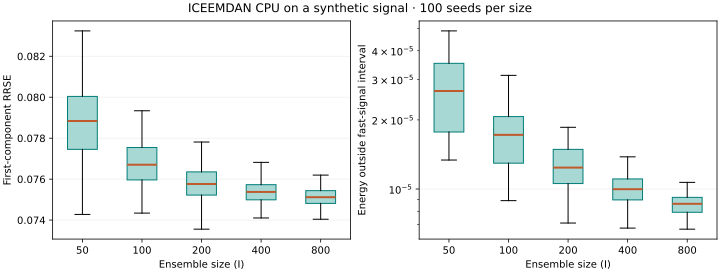

# ICEEMDAN CPU

[](https://github.com/KimiK1983/iceemdan-cpu/actions/workflows/tests.yml)
[](https://github.com/KimiK1983/iceemdan-cpu/actions/workflows/tests.yml)
[](LICENSE)

Implementación importable de **Improved Complete Ensemble Empirical Mode Decomposition with Adaptive Noise** para CPU. Solo necesita NumPy y SciPy en tiempo de ejecución; PyEMD es opcional para una comparación aparte. El repositorio no distribuye registros biomédicos ni imágenes del artículo.

[Instalación y uso](#instalación-y-uso) · [Reproducibilidad](#reproducibilidad) · [Datos públicos](#datos-públicos-opcionales) · [Licencia](#licencia) · [English](README.md)


*Descomposición ilustrativa de cuatro realizaciones, generada por [`scripts/make_synthetic_figure.py`](scripts/make_synthetic_figure.py). Es una gráfica sintética propia, no una figura del artículo ni de un registro clínico.*

## Instalación y uso

Requiere Python 3.10 o posterior:

```bash
python -m pip install .
```

Instale la versión publicada `v2.0.0` directamente desde GitHub:

```bash
python -m pip install "git+https://github.com/KimiK1983/iceemdan-cpu.git@v2.0.0"
```

```python
import numpy as np
from ICEEMDAN import ICEEMDAN

t = np.arange(256, dtype=float)
x = np.sin(0.2 * t) + 0.3 * np.sin(0.7 * t)
model = ICEEMDAN(trials=50, epsilon=0.2, seed=42)
parts = model(x, T=t)
imfs, residue = model.get_imfs_and_residue()
assert np.allclose(parts.sum(axis=0), x)
print(parts.shape, model.diagnostics_["stop_reason"])
```

La última fila de `parts` **siempre es el residuo**. Las filas anteriores son componentes extraídos; la extracción no demuestra por sí sola que sean modos físicos ni IMF exactas. `max_imf` limita el número de componentes. Con `parallel=True`, ejecute desde un script importable protegido por `if __name__ == "__main__":`.

[Método y contratos numéricos](docs/METHOD.md) explica los parámetros, los criterios de parada y los límites.

## Reproducibilidad

El [mapa de reproducibilidad](docs/PAPER_REPRODUCIBILITY.md) separa los contratos del código, las aproximaciones Python, las coincidencias candidatas con datos públicos y las fuentes aún desconocidas de las figuras 1–15. No afirma igualdad numérica con la implementación MATLAB de los autores.

Para pruebas breves: `python -m pytest -q`. El experimento sintético completo terminó con **500/500 corridas correctas**, 100 semillas por tamaño y `epsilon=0.2`, usando Python 3.13.3, NumPy 2.2.5 y SciPy 1.15.3. Se distribuyeron corridas independientes entre 12 procesos; cada descomposición fue serial. El SHA-256 del módulo fue `2de7564f9f01560ff1d3b1d87af12e88e34b3647152616dce5d2e90c926b695f`.



*RRSE de la primera componente y energía fuera del intervalo de la señal rápida, calculados con las 500 corridas enlazadas abajo. Cada caja representa 100 semillas de un tamaño de ensemble.*

| I | RRSE medio primera componente | RRSE medio primer residuo | Energía media a la izquierda | RRSE máximo de reconstrucción |
|---:|---:|---:|---:|---:|
| 50 | 0.078761 | 0.039302 | 2.878e-5 | 8.14e-17 |
| 100 | 0.076664 | 0.038255 | 1.728e-5 | 8.22e-17 |
| 200 | 0.075770 | 0.037809 | 1.272e-5 | 8.09e-17 |
| 400 | 0.075342 | 0.037595 | 1.005e-5 | 8.04e-17 |
| 800 | 0.075087 | 0.037468 | 8.646e-6 | 8.09e-17 |

La gráfica procede únicamente de las [500 filas ordenadas](results/synthetic_20260928/rows.jsonl). Están disponibles el [manifiesto](results/synthetic_20260928/manifest.json) y el [análisis validado](results/synthetic_20260928/analysis.json). El RRSE se compara con las dos componentes sintéticas conocidas; la región izquierda no contiene la componente rápida verdadera. Estos resultados cubren **solo el brazo ICEEMDAN** y no demuestran igualdad con las realizaciones MATLAB de los autores.

El [benchmark serial de CPU](results/benchmark_cpu_20260928.json) se ejecutó después de cerrar los procesos del barrido: una preparación y tres descomposiciones completas cronometradas por tamaño, incluida la construcción del modelo. Equipo: Windows 11, Intel Core Ultra 9 275HX, 24 procesadores lógicos, con las versiones anteriores.

| I | Mediana (s) | Mínimo–máximo (s) |
|---:|---:|---:|
| 50 | 3.849 | 3.333–4.030 |
| 100 | 6.112 | 5.727–7.016 |
| 200 | 12.766 | 11.812–12.803 |
| 400 | 24.303 | 23.610–26.965 |
| 800 | 51.920 | 46.602–58.764 |

Ambos scripts largos requieren `--run`; sin ese indicador solo muestran el plan:

```bash
python -m scripts.run_synthetic_sweep                       # solo muestra el plan
python -m scripts.run_synthetic_sweep --workers 4 --run       # 500 ejecuciones en outputs/
python -m scripts.run_synthetic_sweep --workers 4 --run --resume
python -m scripts.benchmark_cpu                               # solo muestra el plan
python -m scripts.benchmark_cpu --run                          # mediciones completas
```

`--workers` admite 1–12. El archivo JSONL conserva el orden de tamaño y semilla. Reanudar requiere el mismo manifiesto y script. Consulte la [evidencia de validación local](docs/IMPLEMENTATION_STATUS.md).

## Datos públicos opcionales

Los archivos fuente se descargan en `data/` y las matrices locales se escriben en `outputs/`; ambos directorios están excluidos de Git:

```bash
python -m scripts.fetch_public_data keele
python -m scripts.fetch_public_data cudb
python -m scripts.analyze_keele --save-local-arrays
python -m scripts.analyze_cudb --save-local-arrays
```

El [registro de Keele en Zenodo](https://zenodo.org/records/3921794) indica uso no comercial. [CUDB en PhysioNet](https://physionet.org/content/cudb/1.0.0/) tiene sus propios términos de atribución y cita. Revise ambas licencias antes de usar los datos. La ventana ECG `cu01` es una **hipótesis de coincidencia**: el artículo no identifica el registro. Estos análisis no acreditan validez clínica.

Los JSON publicados contienen solo métricas y procedencia: [ventanas Keele](results/public_data_20260928/keele/metrics.json) en 17.275–17.455 s y 25.925–26.025 s, con 9 y 8 componentes, y [CUDB `cu01`](results/public_data_20260928/cudb/metrics.json) en 206–222 s, con 10 componentes y anotación VFON en 214.184 s. Cada análisis usó 100 ensambles, `epsilon=0.2` y semilla 0. Son coincidencias visuales candidatas, no identificaciones confirmadas ni validación clínica.

La comparación opcional `python -m scripts.compare_python_methods` requiere instalar `EMD-signal` (`PyEMD`); la biblioteca principal no lo necesita.

## Licencia

El código original del wrapper usa Apache-2.0. Parte de la geometría deriva de PyEMD bajo Apache-2.0: consulte [avisos de terceros](THIRD_PARTY_NOTICES.md) y [licencia](LICENSE). Las licencias de los datos son independientes de la licencia del código.
